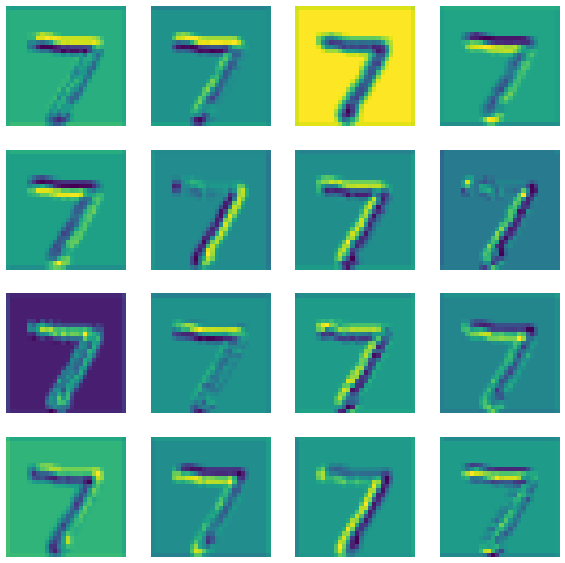
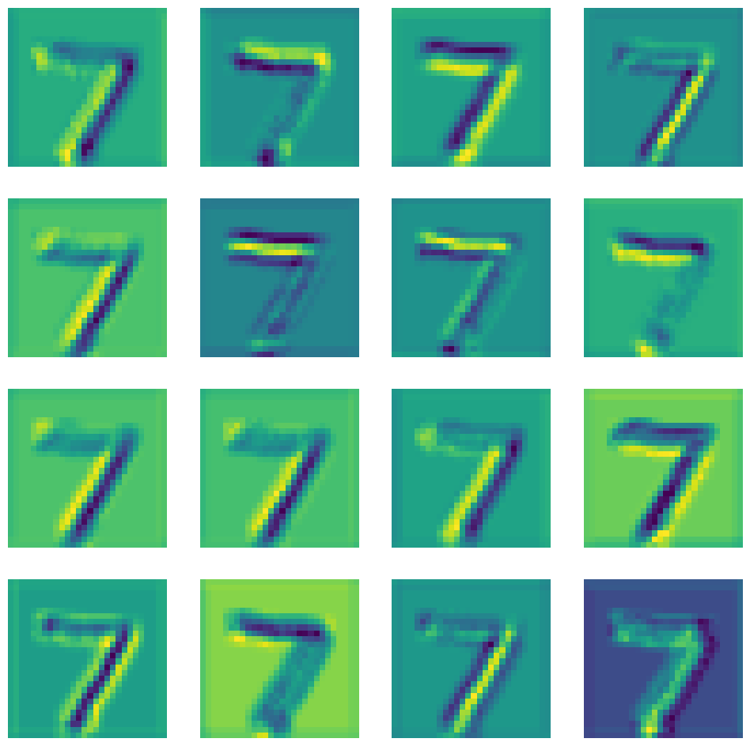
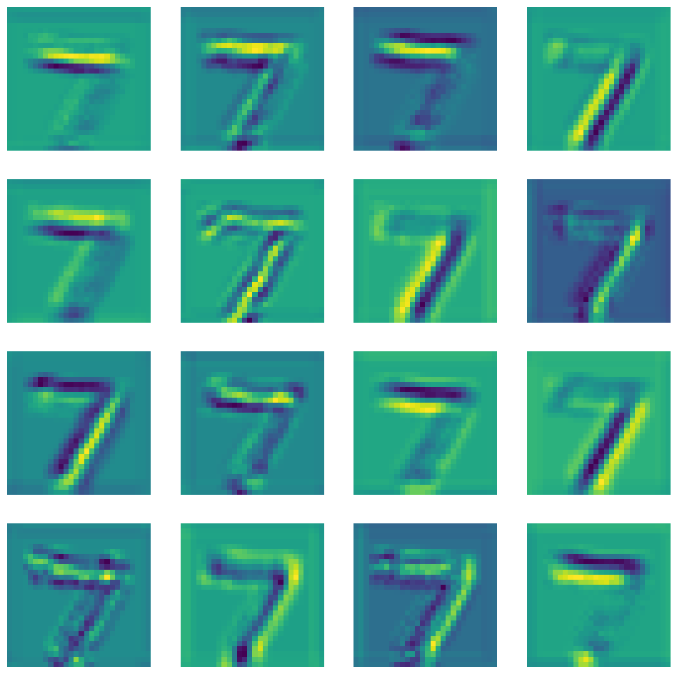

## Задание 1: Сравнение CNN и полносвязных сетей
Сделал 3 модели(полносвязная сеть, простая CNN, CNN с Residual Block) и тренировал их на датасете MNIST
получил такие метрики: 
<ul>
<li>FC-Model max accuracy: 0.9806
<li>Simple CNN max accuracy: 0.992
<li>Residual CNN max accuracy: 0.9924
</ul>

---
График точности и функции потерь для всех моделей:

--- 

Очень долго обучалась модели CNN с Residual Block (14.5 минут), в итоге она на лишь немного лучше чем простая CNN, которая обучалась 3 минуты.

Возможно simple CNN показала бы большую точность при увеличение эпох (она не переобучалась, в отличие от Residual CNN)

Residual CNN и simple CNN имели на протяжение всех эпох точность намного больше чем FC-Model

Самая точная модель - Residual CNN имеет max accuracy: 0.9924 на 3 эпохе

<ul>
<li>FC-Model обучалась 1 минуту и 31 секунд
<li>Simple CNN обучалась 4 минуты и 50 секунды
<li>Residual CNN обучалась 15 минут и 3 секунд
</ul>

<ul>
<li>FC-Model max accuracy: 0.4918
<li>Simple CNN max accuracy: 0.7614
<li>Residual CNN max accuracy: 0.8210
</ul>

***

Создал еще 3 такие же модели(при этом для полносвязной сети уменьшил нейронные сети с [512, 256, 128] до [128, 64, 32], чтобы количество параметров было сопоставимо с другими моделями)

Стоит отметить, что все модели не переобучивались и могут иметь еще большую точность при увеличении эпох. 

Полносвязная сеть показала очень плохой результат(скорее всего из-за количества параметров), Residual CNN демонстрирует самую большую точность т.к запоминает предыдущие детали изображения, Simple CNN имеет точность чуть ниже, чем Residual CNN.

Residual CNN опять обучаеться слишком долго (15 минут и 3 секунд), более чем на 10 минут больше ем Simple CNN 4 минуты и 50 секунды

---
График точности и функции потерь для всех моделей:

---

## Задание 2: Анализ архитектур CNN

Сделал 4 модели CNN с разными размерами ядер свертки (3x3, 5x5, 7x7, комбинация(1x1 + 3x3))

Время обучение всех моделей заняло почти одинаковое время.

Самая высокая точность у CNN с размером ядра свертки 7 на 7. Все модели в моменте переобучались. 
Самые плохие плказатели у CNN с размером ядра свертки 3 на 3 и с комбинационным размером свертки

Несмотя на то, что CNN с размером ядра свертки 3 на 3 имееть одну из худших точностей, она также имеет лучшую (наименьшую) функцию потерь. Ч
уть большую функцию потерь имеет CNN 7 на 7

<b>Визуализация активации первого слоя:</b>
<ul>
<li> Модель с ядром свертки 3 на 3: </li>

<li> Модель с ядром свертки 5 на 5: </li>

<li> Модель с ядром свертки 7 на 7: </li>

<li> Модель с комбинированым ядром свертки 1 на 1 + 3 на 3: </li>

</ul>

***

Сделал 4 модели с разным количеством сверточных слоёв слоев. 
Так получилось, что параметров в restNetNmist CNN модели намного больше, чем в остальных трех моделях (2.797.066 против +- 50000) в следствие чего, она обучалась намного больше, чем другие (40 минут против 3 минут). 

Все модели, кроме маленькой (2 conv слоя) после 3 эпохи начинали переобучаться. 

Самая высокая точность у restNetNmist - 0.9938, после нее идет medium (4 conv слоя) и deep (6 conv слоев) CNN модели(Test Acc: 0.9909 и Test Acc: 0.9910 соответственно)

По карте признаков - по первому слою все модели выделяют примерно одинаковые признаки (паттерны), на последнем слое трудно что либо понять. 

У средней модели (модель с 4 conv слоями) явные проблемы с выделением признаков на последнем слое (изображения 3 на 3), скорей всего это из-за AdaptiveAvgPool2d.
Хотя ее точность составляет 0.9909, значит проблемы нет?

---
График точности и функции потерь для всех моделей:

--- 

## Задание 3: Кастомные слои и эксперименты